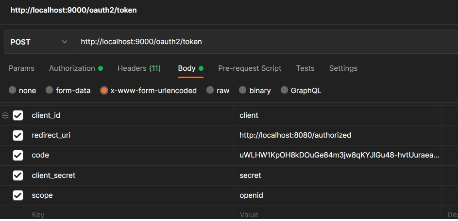
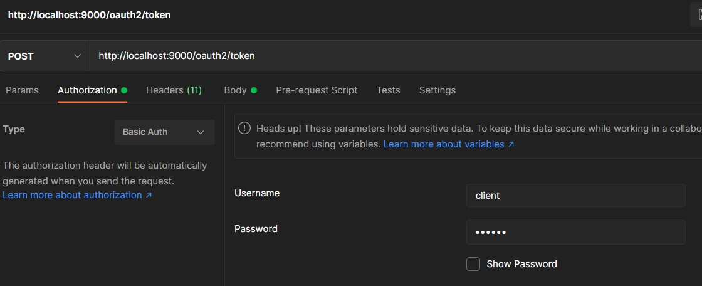
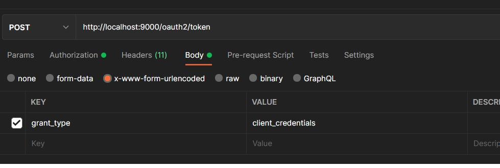
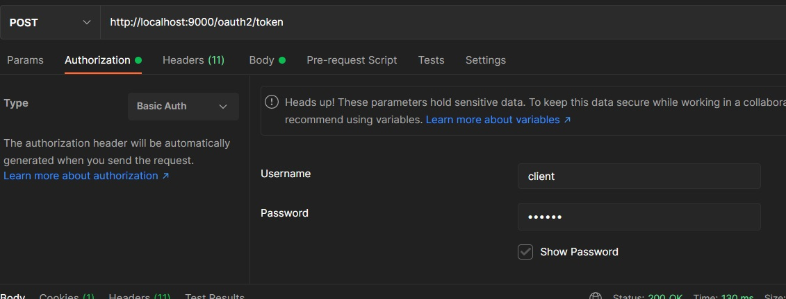

# Getting Started

### Reference Documentation
For further reference, please consider the following sections:

* [Official Apache Maven documentation](https://maven.apache.org/guides/index.html)
* [Spring Boot Maven Plugin Reference Guide](https://docs.spring.io/spring-boot/docs/2.6.1/maven-plugin/reference/html/)
* [Create an OCI image](https://docs.spring.io/spring-boot/docs/2.6.1/maven-plugin/reference/html/#build-image)
* [Spring Boot DevTools](https://docs.spring.io/spring-boot/docs/2.6.1/reference/htmlsingle/#using-boot-devtools)
* [Spring Web](https://docs.spring.io/spring-boot/docs/2.6.1/reference/htmlsingle/#boot-features-developing-web-applications)

### Guides
The following guides illustrate how to use some features concretely:

* [Building a RESTful Web Service](https://spring.io/guides/gs/rest-service/)
* [Serving Web Content with Spring MVC](https://spring.io/guides/gs/serving-web-content/)
* [Building REST services with Spring](https://spring.io/guides/tutorials/bookmarks/)

### Oauth 
http://localhost:9000/oauth2/authorize?response_type=code&client_id=client&scope=openid&redirect_uri=http://localhost:8080/authorized

http://localhost:9000/.well-known/openid-configuration

 
 
 
  

### client authentication 

 
 
  

